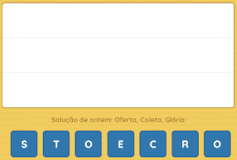
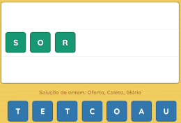

<h1 style="color:#3B88C3">🔡 Imbróglio</h1>

## Como jogar

Segure e arraste as letras da bancada para o quadro

Forme até 3 palavras usando as letras disponíveis

Quanto maiores as palavras formadas, mais pontos você ganha

Volte todos os dias para um novo desafio

E não se esqueça de compartilhar!

 

## 🚀 Criadores

 

## 📂 Arquivos

 

## 🧡 Inspirações

